# Hey, I’m James 👋

Junior at Georgia Tech pursuing a **B.S. in Mathematics** with a concentration in **Data Science**. I have 1.5+ years of internship experience in data engineering, REST API development, and analytics. Currently building a data scraper for Greenhouse job boards.

---

### Technical Skills

**Languages:** Python, SQL, Java, Go, MATLAB

**Data/Backend:** PostgreSQL, SQLite, MySQL, Snowflake, RESTful APIs, dbt, CI/CD, AWS (S3, Aurora, Lambda, IAM)

**Libraries:** Pandas, PySpark, DuckDB, Polars, NumPy, Matplotlib, Scikit-Learn, Openpyxl

**Tools:** Jupyter, Tableau, Docker, Git, Excel, VS Code, Typst

---

