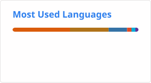

# Hey, I’m James 👋

Junior at Georgia Tech pursuing a **B.S. in Mathematics** with a concentration in **Data Science**. I have 1.5+ years of internship experience in data engineering, REST API development, and analytics. Currently building a stock confidence rating pipeline.

---

### Technical Skills

**Languages:** Python, SQL, Java, Go

**Data/Backend:** PostgreSQL, Databricks, AWS (S3, Aurora, Lambda), SQLite, T-SQL, MySQL, RESTful APIs

**Libraries:** Pandas, DuckDB, Dash, Reflex

**Tools:** Dagster, Jupyter, Tableau, Docker, Render, Git, Excel, Linux/Bash

---

